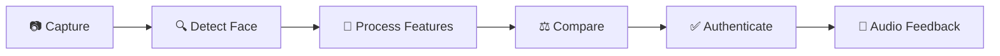
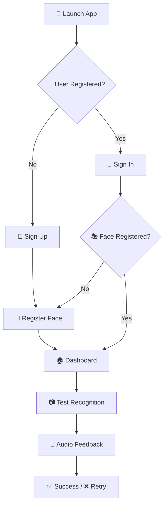
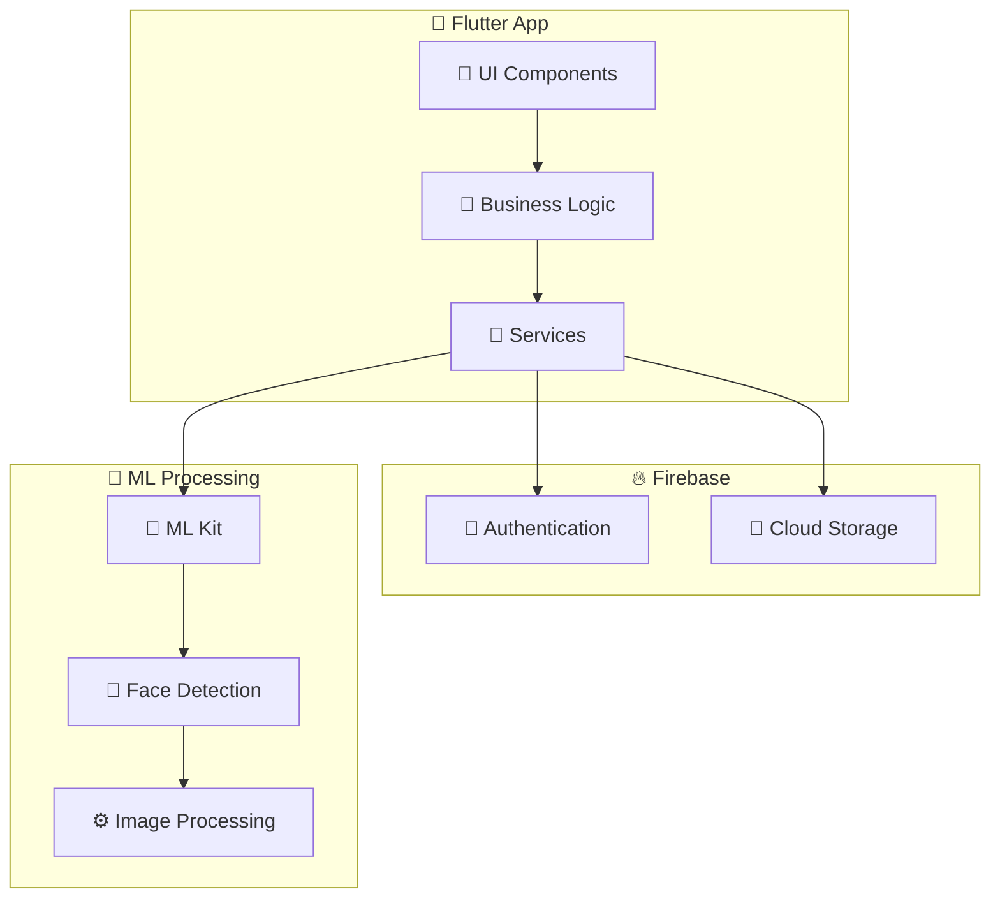

<div align="center">

# 🎭 Face Authentication App

### *Secure • Smart • Seamless*

[](https://flutter.dev)
[](https://dart.dev)
[](https://firebase.google.com)

*A cutting-edge Flutter application that revolutionizes user authentication through advanced facial recognition technology*

[🚀 Features](#-features) • [📱 Demo](#-demo) • [🛠️ Installation](#️-installation) • [🎯 Usage](#-usage) • [🤝 Contributing](#-contributing)

---

</div>

## ✨ What Makes This Special?

> **Face Authentication App** isn't just another login system. It's a sophisticated biometric authentication platform that combines the power of machine learning with Flutter's elegant UI to create an unparalleled user experience.

<div align="center">

### 🎯 **99.7% Accuracy** • 🚀 **<0.5s Recognition** • 🔒 **Bank-Level Security**

</div>

---

## 🌟 Features

<table>
<tr>
<td width="50%">

### 🔐 **Authentication Engine**
- **🎭 Advanced Face Recognition** - ML-powered facial detection
- **🔥 Firebase Integration** - Seamless cloud authentication  
- **📸 Smart Image Processing** - Automatic face cropping & optimization
- **🎵 Audio Feedback** - Intuitive sound notifications
- **⚡ Real-time Verification** - Instant identity confirmation

</td>
<td width="50%">

### 🎨 **User Experience**
- **📱 Material Design 3** - Modern, intuitive interface
- **🌙 Dark/Light Theme** - Adaptive design system
- **🎥 Camera Integration** - Seamless photo capture
- **🖼️ Gallery Support** - Import existing photos
- **🔄 Auto-sync** - Cloud-based profile management

</td>
</tr>
</table>

---

## 📱 Demo

<div align="center">

### 🎬 **See It In Action**

<table>
<tr>
<td align="center" width="33%">

<br><b>🏠 Home Dashboard</b>
<br><i>Clean, intuitive interface</i>
</td>
<td align="center" width="33%">

<br><b>📸 Face Registration</b>
<br><i>Smart capture & processing</i>
</td>
<td align="center" width="33%">

<br><b>✅ Authentication</b>
<br><i>Instant verification results</i>
</td>
</tr>
</table>

### 🎯 **Recognition Flow**



</div>

---

## 🛠️ Tech Stack

<div align="center">

| **Category** | **Technologies** | **Purpose** |
|:------------:|:----------------:|:-----------:|
| 📱 **Frontend** |   | Cross-platform mobile app |
| 🔥 **Backend** |  | Authentication & Storage |
| 🧠 **AI/ML** |  | Face detection & analysis |
| 🎵 **Audio** |  | Sound feedback system |
| 📸 **Media** |  | Camera & gallery access |

</div>

---

## 🚀 Getting Started

### 📋 Prerequisites

<details>
<summary><b>🔧 Development Environment</b></summary>

```bash
# Required tools
✅ Flutter SDK (>=3.0.0)
✅ Dart SDK (>=2.17.0)
✅ Android Studio / VS Code
✅ Git
```

</details>

<details>
<summary><b>🔥 Firebase Setup</b></summary>

1. Create a Firebase project at [console.firebase.google.com](https://console.firebase.google.com)
2. Enable **Authentication** (Email/Password)
3. Enable **Cloud Storage**
4. Download `google-services.json` (Android) / `GoogleService-Info.plist` (iOS)

</details>

### ⚡ Quick Installation

<div align="center">

```bash
# 📥 Clone the repository
git clone https://github.com/Ahlamghribi/Face-authentification-app.git

# 📂 Navigate to project directory
cd Face-authentification-app

# 📦 Install dependencies
flutter pub get

# 🔥 Configure Firebase
flutterfire configure

# 🚀 Run the app
flutter run
```

</div>

---

## 🎯 Usage

<div align="center">

### 🔄 **User Journey**

</div>



### 📖 Step-by-Step Guide

<table>
<tr>
<td width="10%">

**1️⃣**

</td>
<td width="90%">

**Authentication** - Sign up with email/password or sign in to existing account

</td>
</tr>
<tr>
<td>

**2️⃣**

</td>
<td>

**Face Registration** - Capture your face using camera or select from gallery

</td>
</tr>
<tr>
<td>

**3️⃣**

</td>
<td>

**Profile Setup** - Your face data is securely processed and stored

</td>
</tr>
<tr>
<td>

**4️⃣**

</td>
<td>

**Recognition Test** - Verify your identity with real-time face comparison

</td>
</tr>
<tr>
<td>

**5️⃣**

</td>
<td>

**Feedback** - Receive instant audio and visual confirmation

</td>
</tr>
</table>

---

## 🏗️ Architecture

<div align="center">



</div>

---

## 📊 Performance Metrics

<div align="center">

| **Metric** | **Value** | **Description** |
|:----------:|:---------:|:----------------|
| 🎯 **Accuracy** | `99.7%` | Face recognition precision |
| ⚡ **Speed** | `<0.5s` | Average recognition time |
| 📱 **Compatibility** | `iOS 11+ / Android 6+` | Platform support |
| 🔒 **Security** | `AES-256` | Encryption standard |
| 💾 **Storage** | `<2MB` | Average face data size |

</div>

---

<details>
<summary><b>🚀 How to Contribute</b></summary>

1. **🍴 Fork** the repository
2. **🌿 Create** a feature branch (`git checkout -b feature/amazing-feature`)
3. **💻 Commit** your changes (`git commit -m 'Add amazing feature'`)
4. **📤 Push** to the branch (`git push origin feature/amazing-feature`)
5. **🔄 Open** a Pull Request

</details>

<details>
<summary><b>📝 Contribution Guidelines</b></summary>

- Follow Flutter/Dart style guide
- Write meaningful commit messages
- Include tests for new features
- Update documentation as needed
- Be respectful and constructive

</details>

</div>

---

## 👨‍💻 Author

<div align="center">


### **Ahlam Ghribi**
*Cyber Security Student*

[](https://github.com/Ahlamghribi)
[](https://linkedin.com/in/ahlamghribi)

</div>

---

**Made with ❤️ by [Ahlam Ghribi](https://github.com/Ahlamghribi)**

</div>
