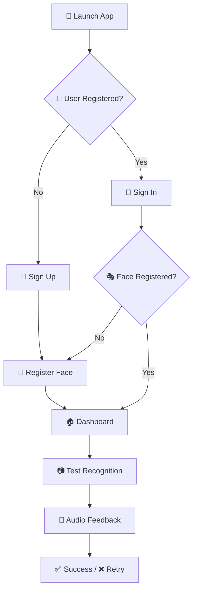

# 🎭 Face Authentication App

*Secure • Smart • Seamless*

[](https://flutter.dev)
[](https://dart.dev)
[](https://firebase.google.com)

**A cutting-edge Flutter application that revolutionizes user authentication through advanced facial recognition technology**

🎯 **99.7% Accuracy** • 🚀 **<0.5s Recognition** • 🔒 **Bank-Level Security**

---

## 🌟 Features

| **🔐 Authentication Engine** | **🎨 User Experience** |
|---|---|
| 🎭 **Advanced Face Recognition** - ML-powered detection | 📱 **Material Design 3** - Modern interface |
| 🔥 **Firebase Integration** - Cloud authentication | 🎥 **Camera Integration** - Seamless capture |
| 📸 **Smart Image Processing** - Auto face cropping | 🖼️ **Gallery Support** - Import photos |
| 🎵 **Audio Feedback** - Sound notifications | 🔄 **Auto-sync** - Cloud profile management |

---

## 📱 Screenshots

| Home Screen | Face Registration | Authentication |
|:---:|:---:|:---:|
|  |  |  |
| Clean Dashboard | Smart Capture | Instant Results |

---

## 🛠️ Tech Stack

 
 
 


---

## 🚀 Quick Start

```bash
git clone https://github.com/Ahlamghribi/Face-authentification-app.git
cd Face-authentification-app
flutter pub get
flutterfire configure
flutter run
```

---

## 🎯 How It Works




---

## 📊 Performance

| Metric | Value | Description |
|:---:|:---:|:---|
| 🎯 **Accuracy** | 99.7% | Face recognition precision |
| ⚡ **Speed** | <0.5s | Average recognition time |
| 📱 **Support** | iOS 11+ / Android 6+ | Platform compatibility |

---

## 🤝 Contributing

**Fork → Branch → Commit → Push → PR**

Follow Flutter/Dart style guide • Write meaningful commits • Be respectful

---
